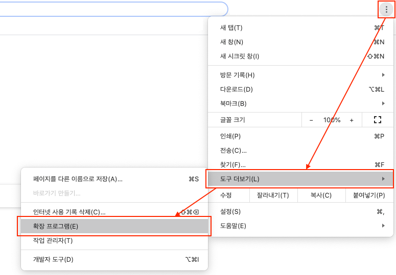
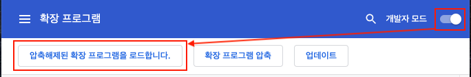
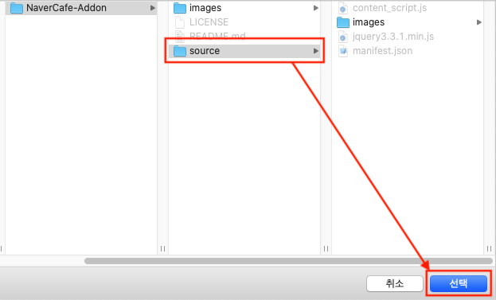

# NaverCafe-Addon
 네이버 카페 관련 편의기능 모음

# 제공하는 기능

- 인기글 리스트 표시
- 프로필 페이지에서 좋아요한 글 리스트 표시

# 적용하는 법

1. 해당 저장소를 클론하거나 source 폴더만 다운로드합니다.

2. Chrome에서 상단 메뉴→도구 더보기→확장 프로그램에 들어갑니다.

3. 개발자 모드를 켜고 '압축해제된 확장 프로그램을 로드합니다.'를 누릅니다.

4. source폴더를 열기 또는 선택합니다.

